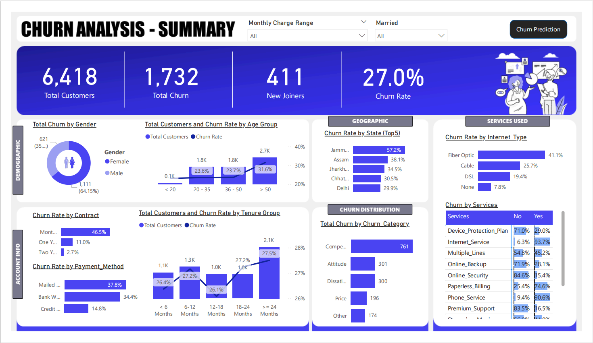

# Customer Churn Prediction Analysis in Telecom.

## Project Overview
This project focuses on predicting customer churn within a telecom company using a machine learning model built with a Random Forest classifier. The analysis identifies key factors contributing to churn and provides insights to enhance customer retention strategies.

## Technologies Used
- **Python**: For data preprocessing and model training.
- **Microsoft SQL Server**: For data extraction and transformation.
- **Power BI**: For creating interactive visualizations and dashboards.
- **Excel**: Used for managing and analyzing data.

## Dataset
The dataset comprises various customer attributes such as age, gender, service usage, billing information, and churn status. Data was processed and labeled using Python and further analyzed using Power BI for visualization.

## Model Development
- **Random Forest Classifier**: Trained to predict churn based on historical data, achieving an accuracy of 84%.
- **Feature Importance**: Analyzed to understand the impact of various attributes on churn.

## Dashboards
Two main dashboards provide a comprehensive view of churn analysis:
- **Churn Prediction Dashboard**: Displays predictions of potential churners with detailed profiles.
- **Churn Summary Dashboard**: Summarizes churn rates across different demographics and service usage.

## Usage
Instructions on how to use the model for prediction and steps to recreate the dashboards are included, ensuring users can leverage the project outputs effectively.

## Future Work
- Enhance the model by incorporating more predictive factors and machine learning techniques.
- Expand the analysis to real-time data streams for proactive churn management.

